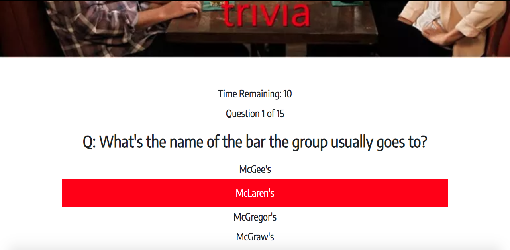

# TriviaGame

## Overview

In this homework assignment for Rutgers Coding Bootcamp, students were asked to create a trivia game using JavaScript for the logic and jQuery to manipulate HTML.

## How this app works
This is the advanced assignment with the theme of the TV show, "How I Met Your Mother." The app will show only one question until the player answers it or their time runs out.

If the player selects the correct answer, a screen is shown congratulating them for choosing the right option. After a few seconds, the next question will be displayed without user input.

The scenario is similar for wrong answers and time-outs.

If the player runs out of time, the player will be told that time's up and display the correct answer. Wait a few seconds, then show the next question.

If the player chooses the wrong answer, the player will be told they selected the wrong option and then display the correct answer. Wait a few seconds, then show the next question.

On the final screen, show the number of correct answers, incorrect answers, and an option to restart the game (without reloading the page).

## Screenshots
Home page

Question page

Correct answer page

Incorrect answer page

Results page
